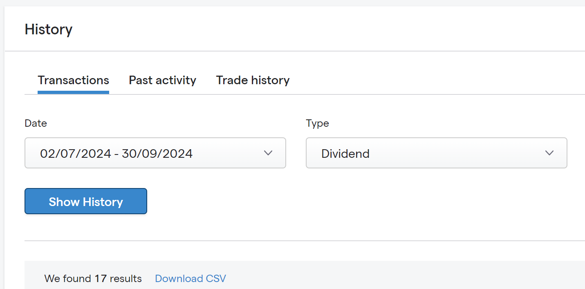

# Introduction 🚀️

If you are a client of IG and want to keep track of your dividends over time, you are in the right place!

This application enables you to easily and quickly generate bar charts to show your dividend growth over time.

You can generate bar charts to show your:

- monthly dividends over time
- quarterly dividends over time
- yearly dividends over time

---

## Steps

To run the Python code, you'll need to follow these steps:

1. Set up your Python environment:

   - Install Python: If you don't have Python installed, download and install it from the official Python website (https://www.python.org/downloads/). Choose the latest version suitable for your operating system.

2. Install required libraries:

   - Open a terminal or command prompt.
   - Install the necessary libraries using pip (Python's package installer):
     ```
     pip install pandas matplotlib seaborn
     ```

3. Clone this repository: https://github.com/emilpk/ig-dividendtracker
4. Prepare your data:

   - Export your dividend history as a CSV file from your [IG account](https://www.ig.com).
   - 
   - Rename the file to 'IG-DividendTransactionHistory.csv' and ensure it is in the **source** folder of this repository.

5. To generate the monthly dividend bar chart:
   In the terminal, navigate to the directory containing your scripts and run:

   ```
   python monthlydividends.py
   ```

6. To generate the quarterly dividend bar chart:
   In the terminal, navigate to the directory containing your scripts and run:

   ```
   python quarterlydividends.py
   ```

7. To generate the yearly dividend bar chart:
   In the terminal, navigate to the directory containing your scripts and run:

   ```
   python yearlydividends.py
   ```

That's it! 🎉️

If you encounter any issues or need more detailed instructions for your specific setup, please let me know, and I'll be happy to help further.
