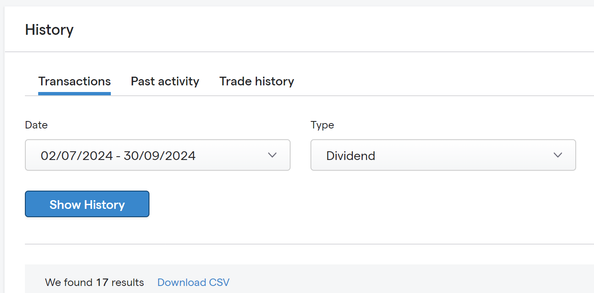
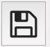

# Introduction 🚀️

If you are a client of IG and want to keep track of your dividends over time, you are in the right place!

This application enables you to easily and quickly generate bar charts to show your dividend growth over time.

You can generate bar charts to show your:

- monthly dividends over time
- quarterly dividends over time
- yearly dividends over time

---

## Prerequisites

- Python 3.7 or higher
- Git (to clone the repository)

---

## Setup Instructions

### 1. Clone the Repository

```bash
git clone https://github.com/emilpk/ig-dividendtracker
cd ig-dividendtracker
```

### 2. Set Up Virtual Environment

Create and activate a virtual environment to keep dependencies isolated:

**On macOS/Linux:**
```bash
python3 -m venv venv
source venv/bin/activate
```

**On Windows:**
```bash
python -m venv venv
venv\Scripts\activate
```

### 3. Install Required Packages

Install all required dependencies from the requirements file:

```bash
pip install -r requirements.txt
```

### 4. Prepare Your Data

1. Export your dividend history as a CSV file from your [IG account](https://www.ig.com)
   

2. Rename the file to `IG-DividendTransactionHistory.csv` and place it in the **source** folder

### 5. Clean Your Data (Important!)

Before generating reports, clean your CSV file to remove any withdrawal transactions:

```bash
python3 clean_csv.py
```

This script will:
- Remove rows where Transaction type is "WITH" (withdrawals)
- Keep only dividend deposits for accurate reporting
- Display how many rows were removed

---

## Generate Reports

Once your data is cleaned, you can generate the dividend reports:

### Monthly Dividend Report
```bash
python3 monthlydividends.py
```

### Quarterly Dividend Report
```bash
python3 quarterlydividends.py
```

### Yearly Dividend Report
```bash
python3 yearlydividends.py
```

All generated charts can be saved using the save icon  and placed in the **reports** folder.

---

## File Structure

```
ig-dividendtracker/
├── source/                          # Place your CSV file here
│   └── IG-DividendTransactionHistory.csv
├── reports/                         # Generated charts appear here
├── assets/                          # Documentation images
├── venv/                           # Virtual environment (created after setup)
├── clean_csv.py                    # Data cleaning script
├── monthlydividends.py             # Monthly report generator
├── quarterlydividends.py           # Quarterly report generator
├── yearlydividends.py              # Yearly report generator
├── requirements.txt                # Python dependencies
└── Readme.md                       # This file
```

---

## Troubleshooting

### Virtual Environment Issues
- Make sure you've activated the virtual environment before running scripts
- If you see "command not found" errors, check that Python is properly installed

### Data Issues
- Always run `clean_csv.py` after updating your CSV file
- Ensure your CSV file is named exactly `IG-DividendTransactionHistory.csv`
- Check that the CSV file is in the `source/` folder

### Package Installation Issues
- If pip install fails, try upgrading pip: `pip install --upgrade pip`
- On some systems, you might need to use `python` instead of `python3`

---

## Deactivating Virtual Environment

When you're done working with the project, deactivate the virtual environment:

```bash
deactivate
```

---

That's it! 🎉️

If you encounter any issues or need more detailed instructions for your specific setup, please open an issue on GitHub.
